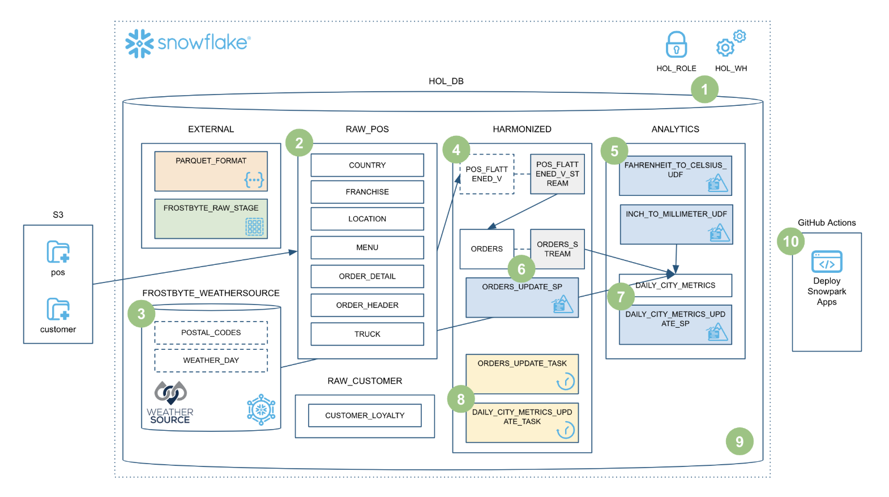
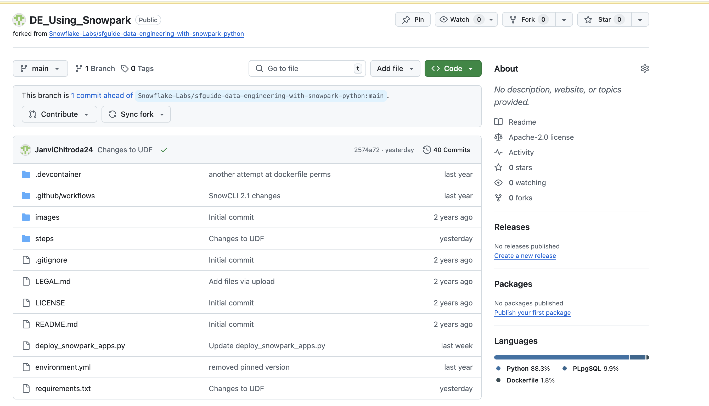
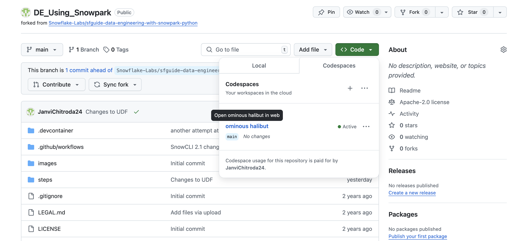
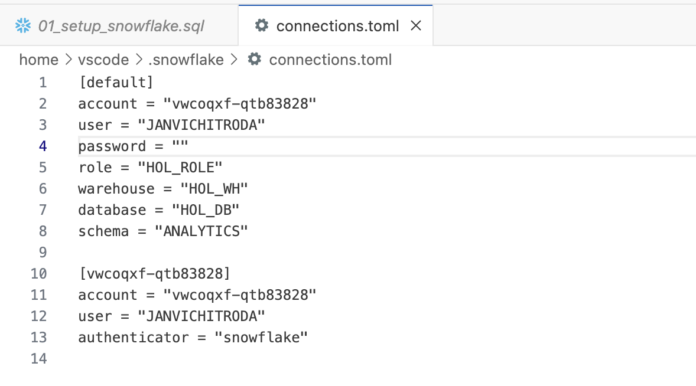
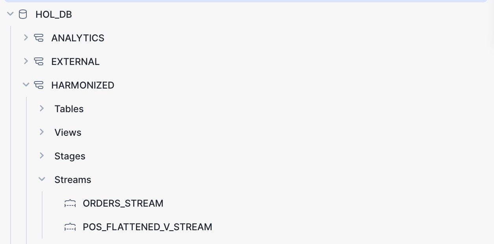
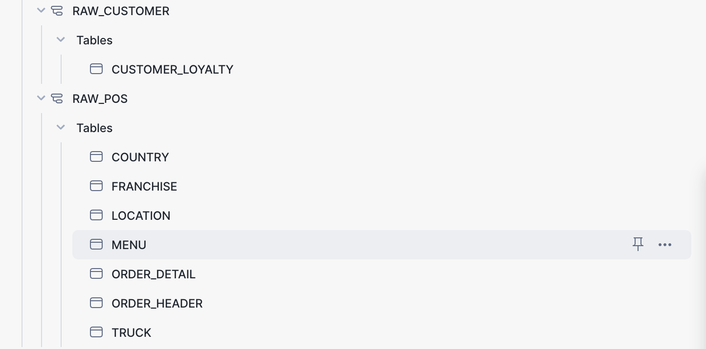
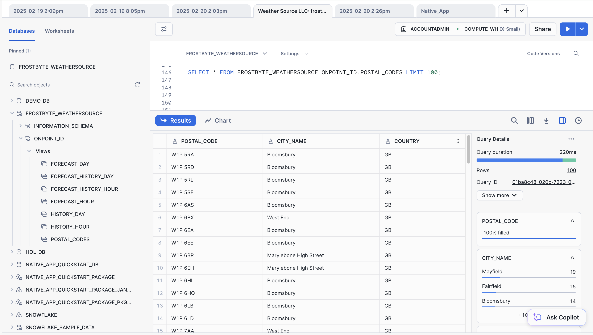
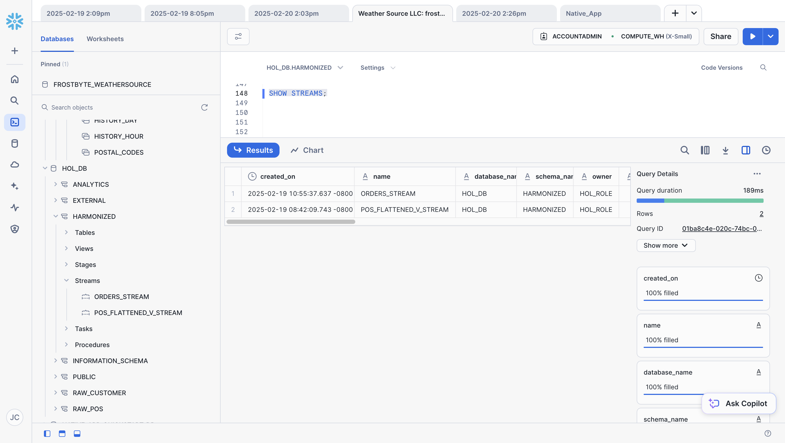

# Getting Started with Data Engineering Pipelines with Snowpark Python Notebook
This repository contains the code for the *Getting Started with Data Engineering using Snowflake Notebooks* Snowflake Quickstart.

### ➡️ For an overview, prerequisites, and detailed instructions, complete this end-to-end tutorial:  
[Data Engineering Pipelines with Snowpark Python](https://quickstarts.snowflake.com/guide/data_engineering_pipelines_with_snowpark_python/index.html?index=..%2F..index#0) on Quickstarts on Snowflake.com.

___
### **Overview of the Tutorial**
This tutorial walks through the key steps to set up a data engineering pipeline using **Snowflake Notebooks**.



---

## **Step 1: Fork the Quickstart Repository and Enable GitHub Actions**
Fork the Data Engineering Pipelines with Snowpark Python repository.
Enable GitHub Actions in your forked repository.

📌 **Important**: Ensure workflows are enabled before proceeding.



---

## **Step 2: Create GitHub Codespace*
- Click "Code" → "Codespaces" → "Create codespace on main".
- This will launch a hosted VS Code environment.


---

## **Step 3: Configure Snowflake Credentials**
1. Open the `~/.snowflake/connections.toml` file.  
2. Replace **account, user, and password** with your credentials.  
3. Save and close the file.  

📌 **Note:** SnowCLI currently does not support **Key Pair authentication**.  


---

## Step 4: Setup Snowflake  
1. Install the **Snowflake Extension** for VS Code.  
2. Log in to Snowflake with **ACCOUNTADMIN** permissions.  
3. Open `steps/01_setup_snowflake.sql` in VS Code.  
4. Run all queries using **"Execute All Statements"** button on vscode.  



---

## **Step 5:  Load Raw Data **
1. Execute `steps/02_load_raw.py` to load raw data.  
2. This can be done via the **VS Code terminal**.



---

## **Step 6: Load Weather Data**
Connect to **Weather Source LLC: frostbyte** in the **Snowflake Marketplace**:  
1. Login to **Snowsight** → **Marketplace**.  
2. Search and select **Weather Source LLC: frostbyte**.  
3. Click **Get**, set database name to `FROSTBYTE_WEATHERSOURCE`, and assign role `HOL_ROLE`.  
✅ **Screenshot**: Run the query to verify data:    

```sql
SELECT * FROM FROSTBYTE_WEATHERSOURCE.ONPOINT_ID.POSTAL_CODES LIMIT 100;
```  



---

## **Step 7: Create POS View (CDC Streams)**
Run the script from the terminal:  

```sh
cd steps  
python 04_create_pos_view.py  
```  

The Snowpark **DataFrame API** defines the POS view and enables **Change Data Capture (CDC)** via Snowflake Streams.  

✅ **Screenshot**: Successful creation of streams



---

## **Step 8: Fahrenheit to Celsius UDF**

Deploy the UDF using **SnowCLI**:  

```sh
cd steps/05_fahrenheit_to_celsius_udf  
snow snowpark build  
snow snowpark deploy  
```  

Run in Snowflake:  

```sql
SELECT ANALYTICS.FAHRENHEIT_TO_CELSIUS_UDF(35);
```  

✅ **Screenshot**: Subscription confirmation.


---

## **Step 9: Orders and Daily City Metrics Update Sproc **
Deploy a **Snowpark Python stored procedure (sproc)** to merge `HARMONIZED.POS_FLATTENED_V_STREAM` into `HARMONIZED.ORDERS`.  

✅ **Screenshot**: Sample rows from loaded tables. 


---

## **Step 10: Orchestrate Jobs **
Use **Snowflake Tasks** to orchestrate Snowpark pipelines:  
1. Create tasks for each stored procedure.  
2. Chain and execute them.  

✅ **Screenshot**: Table verification.  


---

## **Step 11: Process Incrementally  s**
- Run `steps/09_process_incrementally.sql` in VS Code to process new POS order data incrementally.  

✅ **Screenshot**: DAG execution result.  


---

## **Step 12: Deploy to Production**
- Modify `FAHRENHEIT_TO_CELSIUS_UDF()` to use a third-party package. Configure **GitHub Actions** with repository secrets for **SnowCLI** authentication.  

✅ **Screenshot**: Successful deployment.  


---

## 🎯 **Final Thoughts**
This Quickstart guided you through building a data engineering pipeline using Snowpark Python, incorporating incremental processing, Snowflake Tasks, and CI/CD deployment. You explored UDFs, stored procedures, Streams for CDC, and the Snowpark DataFrame API, along with SnowCLI and the VS Code extension for seamless development. With these fundamentals, you're ready to build and optimize your own scalable Snowflake pipelines!

🚀 **Happy Coding!**
